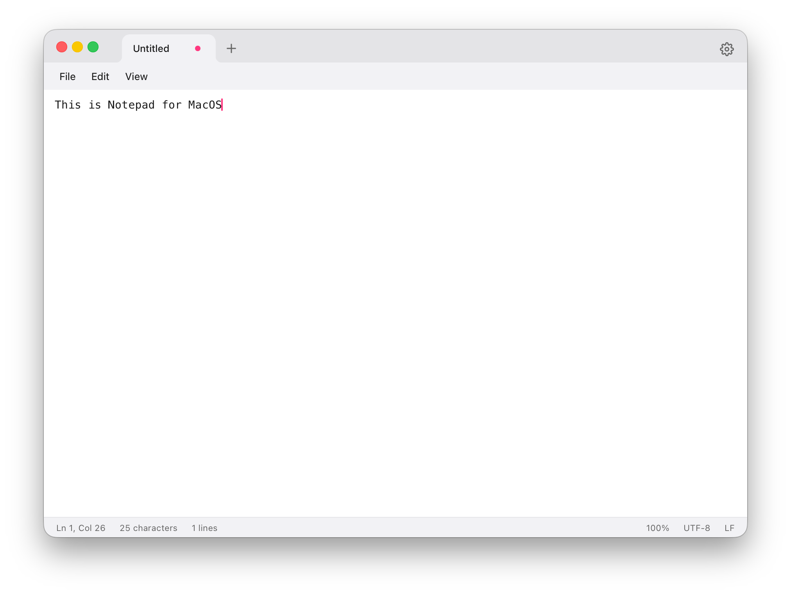
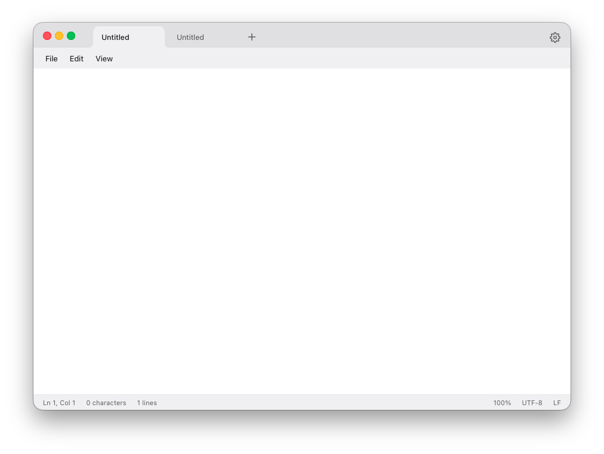
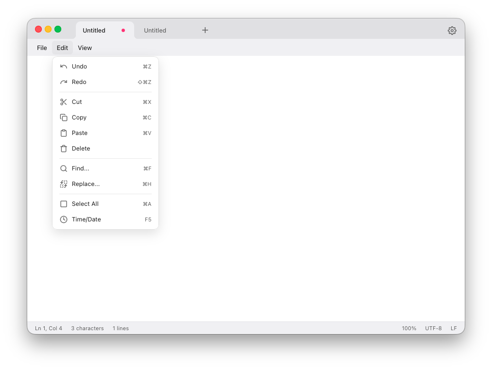
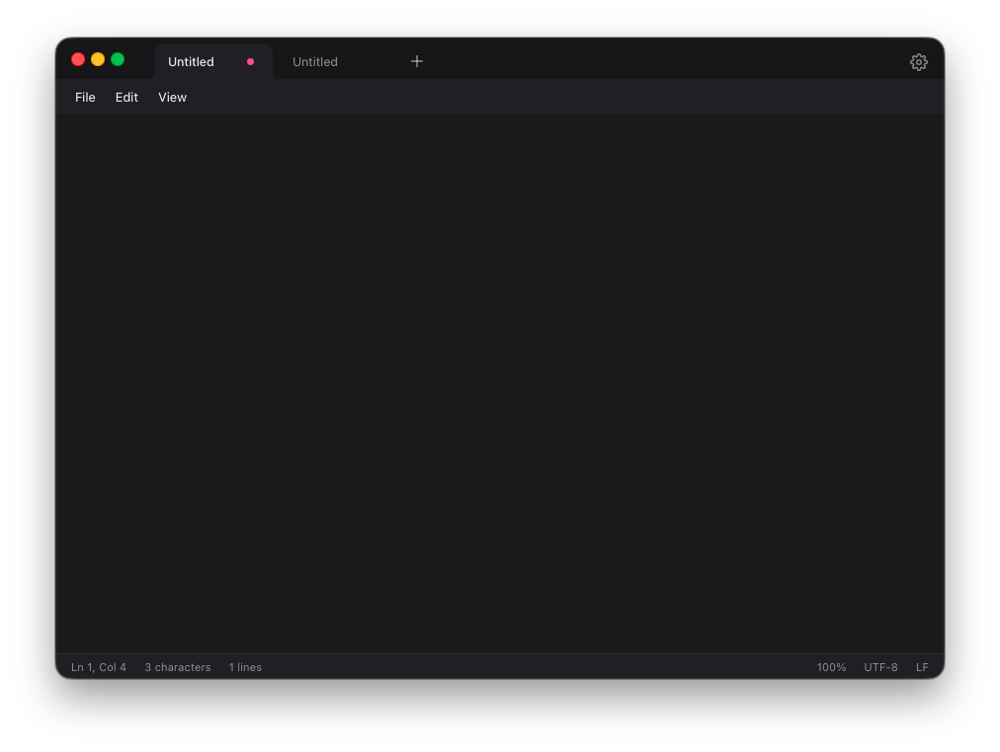
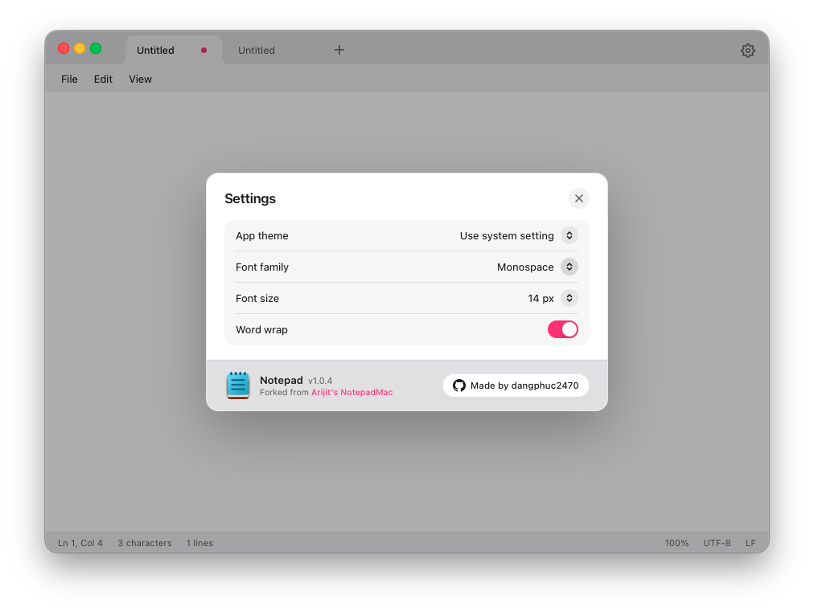

# Notepad for macOS

A modern, fast, and authentic Windows 11 Notepad recreation crafted for macOS. Built with Tauri v2, Rust, and React, featuring native macOS window integration, Fluent Design aesthetics, tabbed editing, and instant startup.

<div align="center">
  
</div>

<p align="center">
  
  
  
  
  
</p>

---

## Features

- **Blazing Fast and Lightweight**: Powered by Rust backend and native macOS WebKit (< 15MB app size, ~35MB RAM).
- **Authentic Windows 11 Fluent Design**:
  - Seamless 3-layer Fluent contrast (Titlebar &rarr; MenuBar &rarr; Editor canvas).
  - Chrome / Edge-style concave bottom tab curves.
  - Native macOS 26 window squircle and centered Traffic Light integration.
- **Tabbed Multitasking**: Open, switch, reorder, and close tabs with middle-click or keyboard shortcuts.
- **Native File Associations**:
  - Full support for `.txt`, `.md`, `.log`, `.json`, `.csv`, `.toml`, `.yaml`, `.py`, `.rs`, `.ts`, and more.
  - Double-click files in Finder or right-click **Open With &rarr; Notepad** to open instantly.
- **Native Close and Save Guards**: Sequential `NSAlert` modal save protection preventing accidental data loss.
- **Dark and Light Modes**: Full dynamic theme support syncing with macOS appearance or customizable in Settings.
- **macOS 26 Settings Panel**: Clean grouped card settings for Font, Size, Theme, and Word Wrap.

---

## Screenshots

<div align="center">
  <h3>Light Mode</h3>
  
  <br /><br />
  <h3>Menu Bar</h3>
  
  <br /><br />
  <h3>Dark Mode</h3>
  
  <br /><br />
  <h3>Settings Panel</h3>
  
</div>

---

## Getting Started

### Prerequisites

- **Node.js**: v18+ (`npm` or `pnpm`)
- **Rust**: `rustc` & `cargo` installed via [rustup](https://rustup.rs/)

### Development

```bash
# Clone the repository
git clone https://github.com/dangphuc2470/notepad.git
cd notepad

# Install dependencies
npm install

# Run in development mode with Hot Reload
npx @tauri-apps/cli dev
```

### Build Production Bundle

```bash
# Build standalone .app and .dmg installer
npx @tauri-apps/cli build
```

The compiled application will be generated in `src-tauri/target/release/bundle/macos/Notepad.app`.

---

## Keyboard Shortcuts

| Action | Shortcut |
| :--- | :--- |
| **New Tab** | `Cmd + N` |
| **Open File** | `Cmd + O` |
| **Save** | `Cmd + S` |
| **Save As** | `Cmd + Shift + S` |
| **Close Tab** | `Cmd + W` |
| **Find** | `Cmd + F` |
| **Replace** | `Cmd + H` |
| **Settings** | `Cmd + ,` |

---

## Acknowledgements and Credits

- Forked and enhanced from [Arijit-gotsomecodes/NotepadMac---Windows-Notepad-For-Mac](https://github.com/Arijit-gotsomecodes/NotepadMac---Windows-Notepad-For-Mac.git).
- Modernized, polished for macOS 26, and maintained by [dangphuc2470](https://github.com/dangphuc2470).

---

## License and Disclaimer

- Distributed under the **MIT License**.
- *Disclaimer: This is an independent open-source recreation created for educational and personal utility purposes. It is not affiliated with, sponsored, or endorsed by Microsoft Corporation.*
